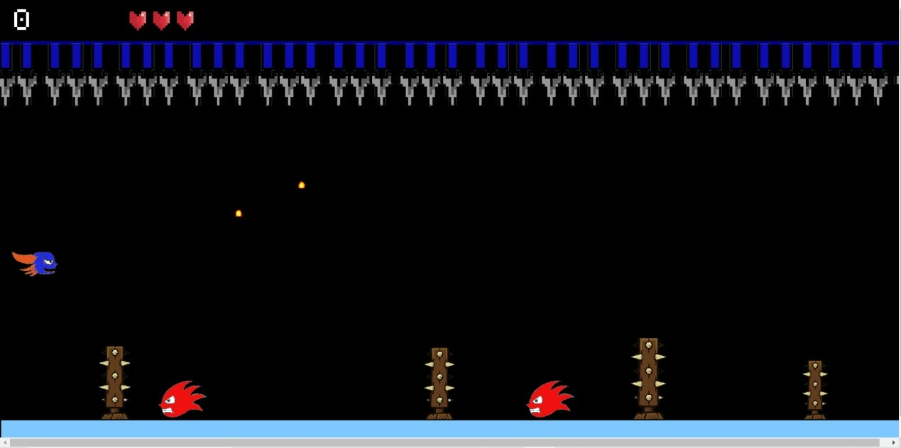
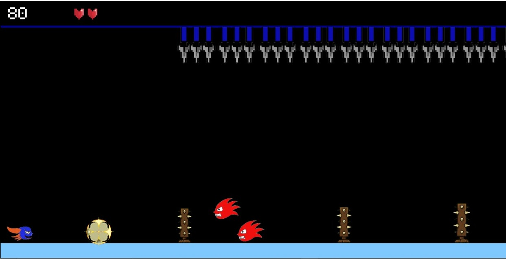
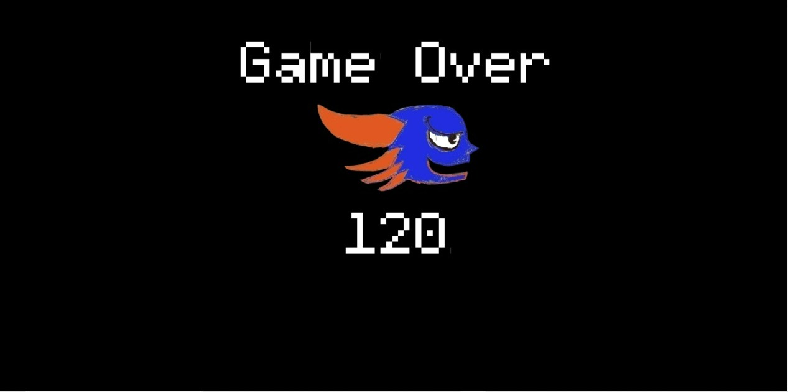

# Shoot 

**Game Link :** https://shoot254.netlify.app/

**I and tirthankarnandi44@gmail.com** built this fun 2-d shooting game
together using **Kaboom.js** library of **Javascript**.

The player has to shoot/avoid enemies and dodge obstacles in the way to survive in the game. 
Shooting enemies will increase your score by 40.

The score and health is visible on the top left corner of the screen.
The player has three lives to start with.
You will lose your health on collision with obstacles, enemies or the spikes above.
Lose all the three lives and the game is over.

**Controls:**
To shoot - press **right arrow key**,
to jump - press **up arrow key**,
to restart after **game over** - press **spacebar**.

**Interesting, isn't it?**

**Thank You**

**Enjoy the Game!**
